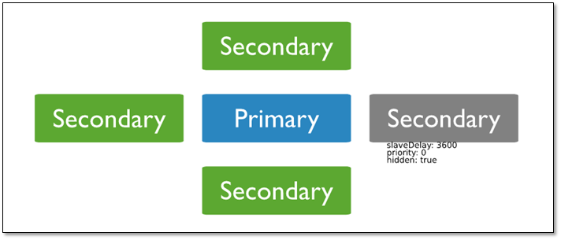

# MongoDB 

官方建议安装前配置：

```bash
WARNING: /sys/kernel/mm/transparent_hugepage/enabled is 'always'.   We suggest setting it to 'never'
WARNING: /sys/kernel/mm/transparent_hugepage/defrag is 'always'.    We suggest setting it to 'never'

WARNING: Access control is not enabled for the database.     # 需要开启访问控制；
```

```bash
# 上述建议的操作：
cat >> /etc/rc.local <<'EOF'
if test -f /sys/kernel/mm/transparent_hugepage/enabled; then
  echo never > /sys/kernel/mm/transparent_hugepage/enabled
fi

if test -f /sys/kernel/mm/transparent_hugepage/defrag; then
   echo never > /sys/kernel/mm/transparent_hugepage/defrag
fi
EOF
```


在Vmware 虚拟化平台上测试后发现，上述操作无效， 经过Google大神的指导，操作如下：

```bash
# 修改grub启动文件，在GRUB_CMDLINE_LINUX行最后加上 transparent_hugepage=never

# vi /etc/default/grub
GRUB_TIMEOUT=5
GRUB_DEFAULT=saved
GRUB_DISABLE_SUBMENU=true
GRUB_TERMINAL_OUTPUT="console"
GRUB_CMDLINE_LINUX="nomodeset crashkernel=auto rd.lvm.lv=vg_os/lv_root rd.lvm.lv=vg_os/lv_swap rhgb quiet transparent_hugepage=never"
GRUB_DISABLE_RECOVERY="true"


####On BIOS-based machines
# grub2-mkconfig -o /boot/grub2/grub.cfg

#### On UEFI-based machines
# grub2-mkconfig -o /boot/efi/EFI/redhat/grub.cfg

# shutdown -r now

#验证：
[root@localhost ~]# cat /proc/cmdline 
BOOT_IMAGE=/vmlinuz-3.10.0-327.el7.x86_64 root=/dev/mapper/centos-root ro crashkernel=auto rd.lvm.lv=centos/root rd.lvm.lv=centos/swap rhgb quiet transparent_hugepage=never
```

[上述操作原文连接,里面还包含了troubleshooting](https://www.thegeekdiary.com/centos-rhel-7-how-to-disable-transparent-huge-pages-thp/)

## 安装(yum)

[官方详细安装文档](https://docs.mongodb.com/manual/tutorial/install-mongodb-on-red-hat/)

```bash
[root@localhost ~]# cat /etc/yum.repos.d/mongodb.repo 
[mongodb-org-4.0]
name=MongoDB Repository
baseurl=https://repo.mongodb.org/yum/redhat/$releasever/mongodb-org/4.0/x86_64/
gpgcheck=1
enabled=1
gpgkey=https://www.mongodb.org/static/pgp/server-4.0.asc


yum clean all
yum makecache
yum search mongodb-org
yum install -y mongodb-org
```

## 启动服务器端：

```bash
[root@localhost ~]# rpm -ql mongodb-org-server
/etc/mongod.conf     # 生成的配置文件
/lib/systemd/system/mongod.service    # 生成的Unit文件，使用systemd就可以管理它了
/usr/bin/mongod       # 服务端可执行命令， 使用它也是可以启动或关闭服务的，具体参数自己看帮助啦；
/usr/share/doc/mongodb-org-server-4.0.9
/usr/share/doc/mongodb-org-server-4.0.9/LICENSE-Community.txt
/usr/share/doc/mongodb-org-server-4.0.9/MPL-2
/usr/share/doc/mongodb-org-server-4.0.9/README
/usr/share/doc/mongodb-org-server-4.0.9/THIRD-PARTY-NOTICES
/usr/share/man/man1/mongod.1
/var/lib/mongo
/var/log/mongodb
/var/log/mongodb/
```

```bash
# mongod 启动/关闭服务举例：
启动：mongod --dbpath=/application/mongodb/data --logpath=/application/mongodb/log/mongodb.log --port=27017 --logappend --fork
关闭：mongod --shutdown  --dbpath=/application/mongodb/data --logpath=/application/mongodb/log/mongodb.log --port=27017 --logappend --fork
```

## 两种方式的配置文件管理数据库：

* 普通格式配置文件：
  
```ini
[mongod@MongoDB conf]$ vim mongod1.conf 
dbpath=/application/mongodb/data
logpath=/application/mongodb/log/mongodb.log
port=27017
logappend=1
fork=1
```

在新版本中，这种格式已经不适用了哈。

使用配置文件时的启动与关闭：

```bash
启动：mongod -f mongod1.conf 
关闭：mongod -f mongod1.conf  --shutdown
```

* YAML格式配置文件(官方推荐)

```bash
# 新版的MongoDB默认已经是YAML格式的配置文件了；

[root@localhost ~]# cat /etc/mongod.conf 
# mongod.conf

# for documentation of all options, see:
#   http://docs.mongodb.org/manual/reference/configuration-options/

# where to write logging data.
systemLog:
  destination: file
  logAppend: true
  path: /var/log/mongodb/mongod.log

# Where and how to store data.
storage:
  dbPath: /var/lib/mongo
  journal:
    enabled: true
#  engine:
#  mmapv1:
#  wiredTiger:

# how the process runs
processManagement:
  fork: true  # fork and run in background
  pidFilePath: /var/run/mongodb/mongod.pid  # location of pidfile
  timeZoneInfo: /usr/share/zoneinfo

# network interfaces
net:
  port: 27017
  bindIp: 127.0.0.1  # Enter 0.0.0.0,:: to bind to all IPv4 and IPv6 addresses or, alternatively, use the net.bindIpAll setting.
```

* 在数据库中关闭数据库的方法：

```bash
[root@localhost ~]# mongo --quiet
> db.shutdownServer()
shutdown command only works with the admin database; try 'use admin'
> use admin
switched to db admin
> db.shutdownServer()
server should be down...
2019-04-11T09:36:48.011+0800 I NETWORK  [js] trying reconnect to 127.0.0.1:27017 failed
2019-04-11T09:36:48.012+0800 I NETWORK  [js] reconnect 127.0.0.1:27017 failed failed 
```

* `强调:`

```
mongod进程收到SIGINT信号或者SIGTERM信号，会做一些处理

> 关闭所有打开的连接

> 将内存数据强制刷新到磁盘

> 当前的操作执行完毕

> 安全停止

　　切忌kill -9

 　　数据库直接关闭，数据丢失，数据文件损失，修复数据库（成本高，有风险）
```

* 使用kill命令关闭进程

```bash
$ kill -2 PID
　　原理：-2表示向mongod进程发送SIGINT信号。
或
$ kill -4 PID
　　原理：-4表示向mognod进程发送SIGTERM信号。
```


## 客户端工具连接服务器端：

```bash
[root@localhost ~]# mongo --help
MongoDB shell version v4.0.9
usage: mongo [options] [db address] [file names (ending in .js)]
db address can be:
  foo                   foo database on local machine
  192.168.0.5/foo       foo database on 192.168.0.5 machine
  192.168.0.5:9999/foo  foo database on 192.168.0.5 machine on port 9999
Options:
  --shell                             run the shell after executing files
  --nodb                              don't connect to mongod on startup - no 
                                      'db address' arg expected
  --norc                              will not run the ".mongorc.js" file on 
                                      start up
  --quiet                             be less chatty
  --port arg                          port to connect to
  --host arg                          server to connect to
  --eval arg                          evaluate javascript
  -h [ --help ]                       show this usage information
  --version                           show version information
  --verbose                           increase verbosity
```

```bash

[root@localhost ~]# mongo mongodb://127.0.0.1:27017/admin
[root@localhost ~]# mongo --host 127.0.0.1:27017

# 带验证的：
[root@localhost ~]# mongo --host mongodb://alice@mongodb0.examples.com:28015/?authSource=admin

[root@localhost ~]# mongo --username alice --password --authenticationDatabase admin --host mongodb0.examples.com --port 28015
```


## MongoDB的基本操作：

Mongodb中关键字种类：

```bash
db（数据库实例级别）
         db本身
             db.connection 数据库下的集合信息
                 db.collection.xxx(
rs（复制集级别）
sh（分片级别）
```

### 查询操作：

* 默认连接的是test数据库：

```bash
[root@localhost ~]# mongo --quiet
> db
test
```

* 在客户端指定数据库进行连接：

```bash
[root@localhost ~]# mongo 127.0.0.1/admin --quiet
> db
admin
```

* 查看当前数据库版本：

```bash
> db.version()
4.0.9
```

* 切换数据库：

```bash
> use test;
switched to db test
> db
test
```

* 显示当前数据库：

```bash
> db
test
> db.getName()
test
```

* 查看当前数据库的当前状态：

```bash
> show dbs
admin   0.000GB
config  0.000GB
local   0.000GB
> use admin
switched to db admin
> db.stats()
{
	"db" : "admin",
	"collections" : 1,
	"views" : 0,
	"objects" : 1,
	"avgObjSize" : 59,
	"dataSize" : 59,
	"storageSize" : 16384,
	"numExtents" : 0,
	"indexes" : 1,
	"indexSize" : 16384,
	"fsUsedSize" : 2513108992,
	"fsTotalSize" : 53660876800,
	"ok" : 1
}
```

* 查看当前数据库的连接机器地址：

```bash
> db.getMongo()
connection to 127.0.0.1:27017
```


### 数据管理

```bash
> show dbs
admin   0.000GB
config  0.000GB
local   0.000GB
 # use数据库，若数据库不存在会自动创建；如果use之后没有创建任何数据集合，系统就会删除这个数据库；
> use clsn         
switched to db clsn
> show dbs
admin   0.000GB
config  0.000GB
local   0.000GB
> db.dropDatabase()    # 删除数据库；
{ "ok" : 1 }
> show dbs
admin   0.000GB
config  0.000GB
local   0.000GB
```

`说明:` 删除数据库时，如果没有选择任何数据库，会删除默认的test数据库。


### 创建集合

* 方法一：

```bash
> show dbs
admin   0.000GB
config  0.000GB
local   0.000GB
> use clsn;                 # 创建了数据库 clsn
switched to db clsn
> db.createCollection('a')   # 创建了集合；
{ "ok" : 1 }
> db.createCollection('b')
{ "ok" : 1 }
> show collections;      # 查看当前数据库里的所有集合；
a
b
> db.getCollectionNames()  # 两种查看的方式返回的数据格式不一样哦；
[ "a", "b" ]
```


* 方法二： 当插入一个文档的时候，一个集合就会自动创建；

```bash
> use clsn;
switched to db clsn
> db.c.insert({name:'clsn'});     # 此处的c时合集的名字，自动创建0；
WriteResult({ "nInserted" : 1 })
> db.c.insert({url:'http://blog.sslinux.com'});
WriteResult({ "nInserted" : 1 })
```

查看创建的合集：

```bash
> db.getCollectionNames()
[ "a", "b", "c" ]
```

查看合集里的内容：

```bash
> db.c.find()
{ "_id" : ObjectId("5caea2c559077b376de125c6"), "name" : "clsn" }
{ "_id" : ObjectId("5caea2fa59077b376de125c7"), "url" : "http://blog.sslinux.com" }
```

重命名合集：

```bash
> db.c.renameCollection("clsn")
{ "ok" : 1 }
> db.getCollectionNames()
[ "a", "b", "clsn" ]
```

删除合集：

```bash
> db.a.drop()
true
> db.getCollectionNames()
[ "b", "clsn" ]
```

插入1w行数据：

```bash
> for(i=0;i<10000;i++) { db.log.insert({"uid":i,"name":"mongodb","age":6,"date":new Date()}); }
WriteResult({ "nInserted" : 1 })

```

查询集合中的所有记录：

```bash
> db.log.find()
{ "_id" : ObjectId("5caea50359077b376de125c8"), "uid" : 0, "name" : "mongodb", "age" : 6, "date" : ISODate("2019-04-11T02:22:59.473Z") }
{ "_id" : ObjectId("5caea50359077b376de125c9"), "uid" : 1, "name" : "mongodb", "age" : 6, "date" : ISODate("2019-04-11T02:22:59.550Z") }
{ "_id" : ObjectId("5caea50359077b376de125ca"), "uid" : 2, "name" : "mongodb", "age" : 6, "date" : ISODate("2019-04-11T02:22:59.550Z") }
{ "_id" : ObjectId("5caea50359077b376de125cb"), "uid" : 3, "name" : "mongodb", "age" : 6, "date" : ISODate("2019-04-11T02:22:59.551Z") }
{ "_id" : ObjectId("5caea50359077b376de125cc"), "uid" : 4, "name" : "mongodb", "age" : 6, "date" : ISODate("2019-04-11T02:22:59.551Z") }
{ "_id" : ObjectId("5caea50359077b376de125cd"), "uid" : 5, "name" : "mongodb", "age" : 6, "date" : ISODate("2019-04-11T02:22:59.551Z") }
{ "_id" : ObjectId("5caea50359077b376de125ce"), "uid" : 6, "name" : "mongodb", "age" : 6, "date" : ISODate("2019-04-11T02:22:59.552Z") }
{ "_id" : ObjectId("5caea50359077b376de125cf"), "uid" : 7, "name" : "mongodb", "age" : 6, "date" : ISODate("2019-04-11T02:22:59.552Z") }
{ "_id" : ObjectId("5caea50359077b376de125d0"), "uid" : 8, "name" : "mongodb", "age" : 6, "date" : ISODate("2019-04-11T02:22:59.552Z") }
{ "_id" : ObjectId("5caea50359077b376de125d1"), "uid" : 9, "name" : "mongodb", "age" : 6, "date" : ISODate("2019-04-11T02:22:59.553Z") }
{ "_id" : ObjectId("5caea50359077b376de125d2"), "uid" : 10, "name" : "mongodb", "age" : 6, "date" : ISODate("2019-04-11T02:22:59.553Z") }
{ "_id" : ObjectId("5caea50359077b376de125d3"), "uid" : 11, "name" : "mongodb", "age" : 6, "date" : ISODate("2019-04-11T02:22:59.553Z") }
{ "_id" : ObjectId("5caea50359077b376de125d4"), "uid" : 12, "name" : "mongodb", "age" : 6, "date" : ISODate("2019-04-11T02:22:59.554Z") }
{ "_id" : ObjectId("5caea50359077b376de125d5"), "uid" : 13, "name" : "mongodb", "age" : 6, "date" : ISODate("2019-04-11T02:22:59.554Z") }
{ "_id" : ObjectId("5caea50359077b376de125d6"), "uid" : 14, "name" : "mongodb", "age" : 6, "date" : ISODate("2019-04-11T02:22:59.554Z") }
{ "_id" : ObjectId("5caea50359077b376de125d7"), "uid" : 15, "name" : "mongodb", "age" : 6, "date" : ISODate("2019-04-11T02:22:59.555Z") }
{ "_id" : ObjectId("5caea50359077b376de125d8"), "uid" : 16, "name" : "mongodb", "age" : 6, "date" : ISODate("2019-04-11T02:22:59.555Z") }
{ "_id" : ObjectId("5caea50359077b376de125d9"), "uid" : 17, "name" : "mongodb", "age" : 6, "date" : ISODate("2019-04-11T02:22:59.555Z") }
{ "_id" : ObjectId("5caea50359077b376de125da"), "uid" : 18, "name" : "mongodb", "age" : 6, "date" : ISODate("2019-04-11T02:22:59.556Z") }
{ "_id" : ObjectId("5caea50359077b376de125db"), "uid" : 19, "name" : "mongodb", "age" : 6, "date" : ISODate("2019-04-11T02:22:59.556Z") }
Type "it" for more
```

`默认每页显示20条记录，当显示不下的的情况下，可以用it迭代命令查询下一页数据。`

```bash
> DBQuery.shellBatchSize=50;  # 设置每页显示50条记录；
50
> db.log.findOne()            # 查看第1条记录；
{
	"_id" : ObjectId("5caea50359077b376de125c8"),
	"uid" : 0,
	"name" : "mongodb",
	"age" : 6,
	"date" : ISODate("2019-04-11T02:22:59.473Z")
}
> db.log.count()                 # 查询总的记录数；
10000
> db.log.find({uid:1000});       # 查询uid为1000的数据；
{ "_id" : ObjectId("5caea50359077b376de129b0"), "uid" : 1000, "name" : "mongodb", "age" : 6, "date" : ISODate("2019-04-11T02:22:59.868Z") }
> 
```

删除集合中的记录数：

```bash
> db.log.distinct("name")          # 查询去掉当前集合中某列的重复数据；
[ "mongodb" ]
> db.log.remove({})                # 删除集合中所有记录；
WriteResult({ "nRemoved" : 10000 })
> db.log.distinct("name")
[ ]
```

查看集合存储信息：

> db.log.stats()  # 查看数据状态；
> db.log.dataSize() # 集合中数据的原始大小；
> db.log.totalIndexSize() # 集合中索引数据的原始大小；
> db.log.totalSize()    # 集合中索引+数据压缩存储之后的大小；
> db.log.storageSize()  # 集合中数据压缩存储的大小；

* pretty() 的使用，显示得好看一些

```bash
> db.log.find({uid:1000}).pretty()
{
	"_id" : ObjectId("5caea8dc59077b376de150c0"),
	"uid" : 1000,
	"name" : "mongodb",
	"age" : 6,
	"date" : ISODate("2019-04-11T02:39:24.430Z")
}
```

## MongoDB中的用户管理

MongoDB数据库默认是没有用户名及密码的，即无权限访问限制。为了方便数据库的管理和安全，需创建数据库用户。

### 用户的权限：

用户中权限的说明 

```bash
权限                      说明
Read                    允许用户读取指定数据库
readWrite               允许用户读写指定数据库
dbAdmin                 允许用户在指定数据库中执行管理函数，如索引创建、删除，查看统计或访问system.profile
userAdmin               允许用户向system.users集合写入，可以找指定数据库里创建、删除和管理用户
clusterAdmin            只在admin数据库中可用，赋予用户所有分片和复制集相关函数的管理权限。
readAnyDatabase         只在admin数据库中可用，赋予用户所有数据库的读权限
readWriteAnyDatabase    只在admin数据库中可用，赋予用户所有数据库的读写权限
userAdminAnyDatabase    只在admin数据库中可用，赋予用户所有数据库的userAdmin权限
dbAdminAnyDatabase      只在admin数据库中可用，赋予用户所有数据库的dbAdmin权限。
root                    只在admin数据库中可用。超级账号，超级权限
```

[更多关于用户权限的说明参照](https://docs.mongodb.com/manual/core/security-built-in-roles/)


* 用户创建语法  

```bash
{
user: "<name>", 
pwd: "<cleartext password>", 
customData: { <any information> }, 
roles: [ 
{ role: "<role>", 
db: "<database>" } | "<role>", 
... 
] 
}
```

* 语法说明：

```bash
user字段：用户的名字;
pwd字段： 用户的密码;
cusomData字段：为任意内容，例如可以为用户全名介绍;
roles字段：指定用户的角色，可以用一个空数组给新用户设定空角色；
roles 字段：可以指定内置角色和用户定义的角色。
```

## 创建管理员用户

进入管理数据库

> use admin

创建管理用户，root权限

```bash
> use admin
switched to db admin
> db.createUser(
... {
...   user: "root",
...   pwd: "root",
...   roles: [ { role: "root", db: "admin" } ]
... }
... )
Successfully added user: {
	"user" : "root",
	"roles" : [
		{
			"role" : "root",
			"db" : "admin"
		}
	]
}
```

`注意:` 创建管理员角色用户的时候，必须到admin下创建。 删除的时候也要到相应的库下操作。


查看创建的管理员用户：

```json
> show users;
{
	"_id" : "admin.root",
	"userId" : UUID("a3b2bb65-a1f3-4199-a652-46c74203a16a"),
	"user" : "root",
	"db" : "admin",
	"roles" : [
		{
			"role" : "root",
			"db" : "admin"
		}
	],
	"mechanisms" : [
		"SCRAM-SHA-1",
		"SCRAM-SHA-256"
	]
}
```

验证用户的 用户名和密码是否可用：

```bash
> db.auth("root","root")
1
```


修改配置文件，开启用户验证：

```bash
cat >>/application/mongodb/conf/mongod.conf<<-'EOF'
security:
  authorization: enabled
EOF

[root@localhost ~]# cat /etc/mongod.conf | grep -A 2 "^security"
security:
  authorization: enabled

[root@localhost ~]# systemctl restart mongod.service
```

重新登陆时，便要使用用户名和密码的方式进行认证了；

```bash
        登陆测试，注意登陆时选择admin数据库
        注意：用户是在哪个数据库下创建的，最后加上什么库。
```

```bash
# 命令行中进行登陆验证；
[root@localhost ~]# mongo -uroot -proot admin
MongoDB shell version v4.0.9
connecting to: mongodb://127.0.0.1:27017/admin?gssapiServiceName=mongodb
Implicit session: session { "id" : UUID("1086c598-930e-4b82-9f48-6da681b57fb4") }
MongoDB server version: 4.0.9
```

```bash
# 在数据库中进行登陆验证：
[root@localhost ~]# mongo --quiet
> use admin
switched to db admin
> db.auth("root","root")
1
```

## 按生产需求创建应用用户：

* 创建对某库的只读用户；

在test库创建只读用户test：

```bash
> use test
switched to db test
> db.createUser(
... {
...   user: "test",
...   pwd: "test",
...   roles: [ { role: "read", db: "test" } ]
... }
... )
Successfully added user: {
	"user" : "test",
	"roles" : [
		{
			"role" : "read",
			"db" : "test"
		}
	]
}
```

测试用户是否创建成功：

```bash
> db.auth("test","test")
1
> show users;     # 报错说验证了太多个用户了；
2019-04-12T02:08:41.946+0800 E QUERY    [js] Error: too many users are authenticated :
_getErrorWithCode@src/mongo/shell/utils.js:25:13
DB.prototype.getUsers@src/mongo/shell/db.js:1763:1
shellHelper.show@src/mongo/shell/utils.js:859:9
shellHelper@src/mongo/shell/utils.js:766:15
@(shellhelp2):1:1

# 登陆test用户，并测试是否是只读：
> show collections;
> db.createCollection('b')
```

## 创建某库的读写用户

创建test1用户，权限为读写；

```bash
> use admin
> db.auth("root","root")

> db.createUser(
... { 
... user: "test1",
... pwd: "test1",
... roles: [ { role: "readWrite", db: "test" } ]
... }
... )
Successfully added user: {
	"user" : "test1",
	"roles" : [
		{
			"role" : "readWrite",
			"db" : "test"
		}
	]
}
```

查看并测试用户

> show users;
> db.auth("test1","test1")


## 创建对多库不同权限的用户：

```bash
[root@localhost ~]# mongo -u root -p root --quiet
> use app
switched to db app
> db.createUser(
...   {
...     user: "app",
...     pwd: "app",
...     roles: [ { role: "readWrite", db: "app" },
...              { role: "read", db: "test" }
...            ]
...   }
... )
Successfully added user: {
	"user" : "app",
	"roles" : [
		{
			"role" : "readWrite",
			"db" : "app"
		},
		{
			"role" : "read",
			"db" : "test"
		}
	]
}
```

查看并测试用户：

```bash
[root@localhost ~]# mongo -u app -p app 127.0.0.1:27017/app --quiet
> db.c.insert( {"name": "JasonX"})
WriteResult({ "nInserted" : 1 })
> db.c.find()
{ "_id" : ObjectId("5caf8d612db4e198613e2ffb"), "name" : "JasonX" }
> show dbs
app  0.000GB
> exit
```

### 删除用户：

删除app用户：先登陆到admin数据库, 然后进入到app库删除app用户；

```bash
[root@localhost ~]# mongo -uroot -proot 127.0.0.1/admin --quiet
> use app
switched to db app
> db.dropUser("app")
true
> show users;
> 
```


## 自定义数据库

创建app数据库的管理员：先登陆到admin数据库；

```bash
[root@localhost ~]# mongo -uroot -proot 127.0.0.1/admin --quiet
> use app
switched to db app
> db.createUser(
... {
... user: "admin",
... pwd: "admin",
... roles: [ { role: "dbAdmin", db: "app" } ]
... }
... )
Successfully added user: {
	"user" : "admin",
	"roles" : [
		{
			"role" : "dbAdmin",
			"db" : "app"
		}
	]
}
```

创建app数据库读写权限的用户并具有clusterAdmin权限：

```bash
> use app
switched to db app
> db.createUser(
... {
... user: "app04",
... pwd: "app04",
... roles: [ { role: "readWrite", db: "app" },
...          { role: "clusterAdmin", db: "admin" }
...        ]
... }
... )
Successfully added user: {
	"user" : "app04",
	"roles" : [
		{
			"role" : "readWrite",
			"db" : "app"
		},
		{
			"role" : "clusterAdmin",
			"db" : "admin"
		}
	]
}
```

## SQL 与 MongoDB 的语句对比：


---


---


---


## MongoDB分片集群技术

### 1.1 MongoDB复制集简介

　一组Mongodb复制集，就是一组mongod进程，这些进程维护同一个数据集合。复制集提供了数据冗余和高等级的可靠性，这是生产部署的基础。

#### 1.1.1 复制集的目的

保证数据在生产部署时的冗余和可靠性，通过在不同的机器上保存副本来保证数据的不会因为单点损坏而丢失。能够随时应对数据丢失、机器损坏带来的风险。

　　换一句话来说，还能提高读取能力，用户的读取服务器和写入服务器在不同的地方，而且，由不同的服务器为不同的用户提供服务，提高整个系统的负载。

#### 1.1.2 简单介绍

　　一组复制集就是一组mongod实例掌管同一个数据集，实例可以在不同的机器上面。实例中包含一个主导，接受客户端所有的写入操作，其他都是副本实例，从主服务器上获得数据并保持同步。

　　主服务器很重要，包含了所有的改变操作（写）的日志。但是副本服务器集群包含有所有的主服务器数据，因此当主服务器挂掉了，就会在副本服务器上重新选取一个成为主服务器。

　　每个复制集还有一个仲裁者，仲裁者不存储数据，只是负责通过心跳包来确认集群中集合的数量，并在主服务器选举的时候作为仲裁决定结果。


### 1.2 复制的借本架构

基本的架构由3台服务器组成，一个三成员的复制集，由三个有数据，或者两个有数据，一个作为仲裁者。

#### 1.2.1 三个存储数据的复制集

具有三个存储数据的成员的复制集有：

```
一个主库；
两个从库组成，主库宕机时，这两个从库都可以被选为主库。
```


当主库宕机后,两个从库都会进行竞选，其中一个变为主库，当原主库恢复后，作为从库加入当前的复制集群即可。


#### 1.2.2 当存在arbiter节点：

在三个成员的复制集中，有两个正常的主从，及一台arbiter节点：

```
一个主库
一个从库，可以在选举中成为主库；
一个arbiter节点，在选举中，只进行投票，不能成为主库；
```


* `说明：`

```
　　由于arbiter节点没有复制数据，因此这个架构中仅提供一个完整的数据副本。arbiter节点只需要更少的资源，代价是更有限的冗余和容错。
```

 当主库宕机时，将会选择从库成为主，主库修复后，将其加入到现有的复制集群中即可。

 


#### 1.2.3 Primary选举

复制集通过replSetInitiate命令（或mongo shell的rs.initiate()）进行初始化，初始化后各个成员间开始发送心跳消息，并发起Priamry选举操作，获得『大多数』成员投票支持的节点，会成为Primary，其余节点成为Secondary。

`『大多数』的定义:`

　　假设复制集内投票成员（后续介绍）数量为N，则大多数为 N/2 + 1，当复制集内存活成员数量不足大多数时，整个复制集将无法选举出Primary，复制集将无法提供写服务，处于只读状态。


通常建议将复制集成员数量设置为奇数，从上表可以看出3个节点和4个节点的复制集都只能容忍1个节点失效，从『服务可用性』的角度看，其效果是一样的。（但无疑4个节点能提供更可靠的数据存储）


### 1.3 复制集中成员说明

#### 1.3.1 所有成员说明


#### 1.3.2 Priority 0 节点

作为一个辅助可以作为一个备用。在一些复制集中，可能无法在合理的时间内添加新成员的时候。备用成员保持数据的当前最新数据能够替换不可用的成员；


#### 1.3.3 Hiddeen节点(隐藏节点)

客户端将不会把读请求分发到隐藏节点上，即使我们设定了 复制集读选项 。

　　这些隐藏节点将不会收到来自应用程序的请求。我们可以将隐藏节点专用于报表节点或是备份节点。 延时节点也应该是一个隐藏节点。


#### 1.3.4 Delayed节点(延时节点)

延时节点的数据集是延时的，因此它可以帮助我们在人为误操作或是其他意外情况下恢复数据。

　　举个例子，当应用升级失败，或是误操作删除了表和数据库时，我们可以通过延时节点进行数据恢复。





### 1.4 配置MongoDB复制集

* 系统环境

```bash
[root@localhost ~]# cat /etc/redhat-release 
CentOS Linux release 7.2.1511 (Core) 
[root@localhost ~]# uname -r
3.10.0-327.el7.x86_64

[root@localhost ~]# systemctl status iptables.service
● iptables.service - IPv4 firewall with iptables
   Loaded: loaded (/usr/lib/systemd/system/iptables.service; disabled; vendor preset: disabled)
   Active: inactive (dead)

[root@localhost ~]# getenforce 
Disabled
[root@localhost ~]# hostname -I
192.168.2.163 
```

#### 1.4.2 前期准备，在root用户下操作：

本次复制集采用Mongod多实例进行；

所有的操作都基于安装完成的mongodb服务；

https://fastdl.mongodb.org/linux/mongodb-linux-x86_64-rhel70-4.0.8.tgz

```bash
[root@localhost ~]# ls -lh mongodb-linux-x86_64-rhel70-4.0.8.tgz 
-rw-r--r-- 1 root root 101M Mar 29 05:59 mongodb-linux-x86_64-rhel70-4.0.8.tgz
[root@localhost ~]# tar xf mongodb-linux-x86_64-rhel70-4.0.8.tgz -C /usr/local/
[root@localhost ~]# cd /usr/local/
[root@localhost local]# ln -sv mongodb-linux-x86_64-rhel70-4.0.8 mongodb
‘mongodb’ -> ‘mongodb-linux-x86_64-rhel70-4.0.8’

[root@localhost local]# ls mongodb/bin/
bsondump  install_compass  mongo  mongod  mongodump  mongoexport  mongofiles  mongoimport  mongoreplay  mongorestore  mongos  mongostat  mongotop

# 将该目录加入到环境变量中：
[root@localhost local]# vim /etc/profile.d/mongodb.sh
[root@localhost local]# source /etc/profile.d/mongodb.sh
[root@localhost local]# cat /etc/profile.d/mongodb.sh
export PATH=/usr/local/mongodb/bin:$PATH
```

#### 1.4.3 创建所需目录

```bash
[root@localhost local]# for i in 28017 28018 28019 28020
> do
>   mkdir -p /mongodb/$i/conf
>   mkdir -p /mongodb/$i/data
>   mkdir -p /mongodb/$9/log
> done
```

#### 1.4.4 配置多实例环境

编辑第一个实例配置文件：

```yaml
cat >>/mongodb/28017/conf/mongod.conf<<'EOF'
systemLog:
  destination: file
  path: /mongodb/28017/log/mongodb.log
  logAppend: true
storage:
  journal:
    enabled: true
  dbPath: /mongodb/28017/data
  directoryPerDB: true
  wiredTiger:
    engineConfig:
      directoryForIndexes: true
    collectionConfig:
      blockCompressor: zlib
    indexConfig:
      prefixCompression: true
processManagement:
  fork: true
net:
  bindIp: 0.0.0.0
  port: 28017
replication:
  oplogSizeMB: 2048
  replSetName: my_repl
EOF
```

* 复制配置文件

```bash
for i in 28018 28019 28020
  do  
   \cp  /mongodb/28017/conf/mongod.conf  /mongodb/$i/conf/
done
```

* 修改配置文件

```bash
for i in 28018 28019 28020
  do 
    sed  -i  "s#28017#$i#g" /mongodb/$i/conf/mongod.conf
done
```


* 启动：

```bash
mongod -f /mongodb/28017/conf/mongod.conf 
mongod -f /mongodb/28018/conf/mongod.conf 
mongod -f /mongodb/28019/conf/mongod.conf 
mongod -f /mongodb/28020/conf/mongod.conf
```

或者：

```bash
for i in 28017 28018 28019 28020
  do  
    mongod -f /mongodb/$i/conf/mongod.conf 
done
```

```bash
[root@localhost local]# ss -tnlp | grep mongod
LISTEN     0      128    127.0.0.1:28017                    *:*                   users:(("mongod",pid=8072,fd=11))
LISTEN     0      128    127.0.0.1:28018                    *:*                   users:(("mongod",pid=8109,fd=11))
LISTEN     0      128    127.0.0.1:28019                    *:*                   users:(("mongod",pid=8146,fd=11))
LISTEN     0      128    127.0.0.1:28020                    *:*                   users:(("mongod",pid=8183,fd=11))

```

*  关闭服务的方法

```bash
for i in 28017 28018 28019 28020
   do  
     mongod --shutdown  -f /mongodb/$i/conf/mongod.conf 
done
```

#### 1.4.5 配置复制集

```bash
[root@localhost local]# mongo --port 28017 --quiet
> config = {_id: 'my_repl', members: [
...                        {_id: 0, host: '192.168.2.163:28017'},
...                        {_id: 1, host: '192.168.2.163:28018'},
...                        {_id: 2, host: '192.168.2.163:28019'}]
...        }
{
	"_id" : "my_repl",
	"members" : [
		{
			"_id" : 0,
			"host" : "192.168.2.163:28017"
		},
		{
			"_id" : 1,
			"host" : "192.168.2.163:28018"
		},
		{
			"_id" : 2,
			"host" : "192.168.2.163:28019"
		}
	]
}
> rs.initiate(config)
{
	"ok" : 1,
	"operationTime" : Timestamp(1555029737, 1),
	"$clusterTime" : {
		"clusterTime" : Timestamp(1555029737, 1),
		"signature" : {
			"hash" : BinData(0,"AAAAAAAAAAAAAAAAAAAAAAAAAAA="),
			"keyId" : NumberLong(0)
		}
	}
}
my_repl:SECONDARY> 
# 表示已经进入名称为my_repl的集群中，当前节点为SECONDARY；

my_repl:PRIMARY> 
# 这样才是PRIMARY节点；
```

#### 1.4.6 测试主从复制；

* 在主节点插入数据：

```bash
my_repl:PRIMARY> db.movies.insert([ { "title" : "Jaws", "year" : 1975, "imdb_rating" : 8.1 },
... { "title" : "Batman", "year" : 1989, "imdb_rating" : 7.6},
... ] );
BulkWriteResult({
	"writeErrors" : [ ],
	"writeConcernErrors" : [ ],
	"nInserted" : 2,
	"nUpserted" : 0,
	"nMatched" : 0,
	"nModified" : 0,
	"nRemoved" : 0,
	"upserted" : [ ]
})
my_repl:PRIMARY> 
```

* 在主节点查看数据：

```bash
my_repl:PRIMARY> db.movies.find().pretty()
{
	"_id" : ObjectId("5cafe0ee7b5815d0cd8c6d8e"),
	"title" : "Jaws",
	"year" : 1975,
	"imdb_rating" : 8.1
}
{
	"_id" : ObjectId("5cafe0ee7b5815d0cd8c6d8f"),
	"title" : "Batman",
	"year" : 1989,
	"imdb_rating" : 7.6
}
my_repl:PRIMARY> 
```

`注：在mongodb复制集当中，默认从库不允许读写。`

`在从库打开配置（危险）`

`注意：严禁在从库做任何修改操作`


```bash
[root@localhost ~]# mongo --port 28018 --quiet
my_repl:SECONDARY> rs.slaveOk()
my_repl:SECONDARY> show tables;
movies
my_repl:SECONDARY> db.movies.find().pretty()
{
	"_id" : ObjectId("5cafe0ee7b5815d0cd8c6d8e"),
	"title" : "Jaws",
	"year" : 1975,
	"imdb_rating" : 8.1
}
{
	"_id" : ObjectId("5cafe0ee7b5815d0cd8c6d8f"),
	"title" : "Batman",
	"year" : 1989,
	"imdb_rating" : 7.6
}
```

#### 1.4.7 复制集管理操作

* (1) 查看复制集状态：

```bash
my_repl:PRIMARY> rs.status();  # 查看整体复制集状态；

my_repl:PRIMARY> rs.isMaster() # 查看当前是否是主节点；
{
	"hosts" : [
		"192.168.2.163:28017",
		"192.168.2.163:28018",
		"192.168.2.163:28019"
	],
	"setName" : "my_repl",
	"setVersion" : 1,
	"ismaster" : true,
	"secondary" : false,
	"primary" : "192.168.2.163:28017",
	"me" : "192.168.2.163:28017",
	"electionId" : ObjectId("7fffffff0000000000000001"),
	"lastWrite" : {
		"opTime" : {
			"ts" : Timestamp(1555030849, 1),
			"t" : NumberLong(1)
		},
```

* (2) 添加删除节点

```bash
# 新增从节点；
my_repl:PRIMARY> rs.add("192.168.2.163:28020")
{
	"ok" : 1,
	"operationTime" : Timestamp(1555031049, 1),
	"$clusterTime" : {
		"clusterTime" : Timestamp(1555031049, 1),
		"signature" : {
			"hash" : BinData(0,"AAAAAAAAAAAAAAAAAAAAAAAAAAA="),
			"keyId" : NumberLong(0)
		}
	}
}
```

```bash
# 删除节点
my_repl:PRIMARY> rs.remove("192.168.2.163:28020")
{
	"ok" : 1,
	"operationTime" : Timestamp(1555031113, 1),
	"$clusterTime" : {
		"clusterTime" : Timestamp(1555031113, 1),
		"signature" : {
			"hash" : BinData(0,"AAAAAAAAAAAAAAAAAAAAAAAAAAA="),
			"keyId" : NumberLong(0)
		}
	}
}
```

```bash
# 新增仲裁节点
my_repl:PRIMARY> rs.addArb("192.168.2.163:18020")
{
	"ok" : 1,
	"operationTime" : Timestamp(1555031282, 1),
	"$clusterTime" : {
		"clusterTime" : Timestamp(1555031282, 1),
		"signature" : {
			"hash" : BinData(0,"AAAAAAAAAAAAAAAAAAAAAAAAAAA="),
			"keyId" : NumberLong(0)
		}
	}
}
```

在mongo shell中使用 rs.status()查看状态时，arbiter节点的状态显示如下：

```bash
{
			"_id" : 3,
			"name" : "192.168.2.163:28020",
			"health" : 1,
			"state" : 7,
			"stateStr" : "ARBITER",
			"uptime" : 27,
			"lastHeartbeat" : ISODate("2019-04-12T01:47:39.248Z"),
			"lastHeartbeatRecv" : ISODate("2019-04-12T01:47:38.886Z"),
			"pingMs" : NumberLong(0),
			"lastHeartbeatMessage" : "",
			"syncingTo" : "",
			"syncSourceHost" : "",
			"syncSourceId" : -1,
			"infoMessage" : "",
			"configVersion" : 8
		}
```